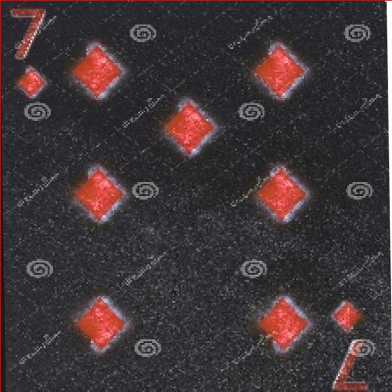

# 扑克牌点数识别检测系统源码分享
 # [一条龙教学YOLOV8标注好的数据集一键训练_70+全套改进创新点发刊_Web前端展示]

### 1.研究背景与意义

项目参考[AAAI Association for the Advancement of Artificial Intelligence](https://gitee.com/qunshansj/projects)

项目来源[AACV Association for the Advancement of Computer Vision](https://gitee.com/qunmasj/projects)

研究背景与意义

随着计算机视觉技术的迅猛发展，物体检测与识别的应用场景日益广泛，涵盖了安防监控、自动驾驶、智能家居等多个领域。在这些应用中，扑克牌的点数识别作为一种特定的视觉识别任务，具有重要的实用价值。扑克牌不仅是休闲娱乐的工具，更在竞技游戏、心理学研究及人工智能训练中扮演着重要角色。因此，开发一个高效、准确的扑克牌点数识别系统，不仅能够提升游戏体验，还能为相关领域的研究提供支持。

近年来，YOLO（You Only Look Once）系列模型因其快速的检测速度和较高的准确率而受到广泛关注。YOLOv8作为该系列的最新版本，进一步优化了网络结构，提高了检测精度和速度，适合实时应用。尽管YOLOv8在多种物体检测任务中表现出色，但在特定场景下，尤其是针对扑克牌点数的识别，仍然存在一些挑战。扑克牌的点数具有相似的视觉特征，且在不同的光照条件、角度和背景下，识别的难度会显著增加。因此，基于改进YOLOv8的扑克牌点数识别系统的研究，具有重要的理论和实践意义。

本研究所使用的数据集包含3300张图像，涵盖了扑克牌的13个类别，包括数字牌（2至10）、字母牌（A、J、K、Q）。每个类别的样本数量相对均衡，为模型的训练提供了良好的基础。通过对这些数据的分析与处理，可以有效提高模型的泛化能力和识别精度。此外，数据集中包含的多样化图像样本，能够模拟现实中扑克牌的多种使用场景，为模型的鲁棒性提供了保障。

在实际应用中，扑克牌点数识别系统可以广泛应用于在线扑克游戏、智能卡牌识别设备、以及辅助盲人识别扑克牌等领域。通过提高识别的准确性和速度，能够有效提升用户体验，降低人为操作的错误率。同时，该系统的研究成果也将为其他物体检测任务提供借鉴，推动计算机视觉技术的进一步发展。

综上所述，基于改进YOLOv8的扑克牌点数识别系统的研究，不仅具有重要的学术价值，还能为实际应用提供有力支持。通过对现有YOLOv8模型的改进和优化，结合特定的数据集，旨在实现高效、准确的扑克牌点数识别，为相关领域的研究和应用开辟新的方向。

### 2.图片演示


##### 注意：由于此博客编辑较早，上面“2.图片演示”和“3.视频演示”展示的系统图片或者视频可能为老版本，新版本在老版本的基础上升级如下：（实际效果以升级的新版本为准）

  （1）适配了YOLOV8的“目标检测”模型和“实例分割”模型，通过加载相应的权重（.pt）文件即可自适应加载模型。

  （2）支持“图片识别”、“视频识别”、“摄像头实时识别”三种识别模式。

  （3）支持“图片识别”、“视频识别”、“摄像头实时识别”三种识别结果保存导出，解决手动导出（容易卡顿出现爆内存）存在的问题，识别完自动保存结果并导出到tempDir中。

  （4）支持Web前端系统中的标题、背景图等自定义修改，后面提供修改教程。

  另外本项目提供训练的数据集和训练教程,暂不提供权重文件（best.pt）,需要您按照教程进行训练后实现图片演示和Web前端界面演示的效果。

### 3.视频演示

[3.1 视频演示](https://www.bilibili.com/video/BV1YN4tetEJc/)

### 4.数据集信息展示

##### 4.1 本项目数据集详细数据（类别数＆类别名）

nc: 13
names: ['10', '2', '3', '4', '5', '6', '7', '8', '9', 'A', 'J', 'K', 'Q']


##### 4.2 本项目数据集信息介绍

数据集信息展示

在本研究中，我们采用了名为“cdetect”的数据集，以支持对扑克牌点数的高效识别，进而改进YOLOv8模型的性能。该数据集专门为扑克牌点数识别任务而设计，包含了丰富的样本和多样的类别，确保了模型在实际应用中的准确性和鲁棒性。数据集的类别数量为13，涵盖了扑克牌中所有常见的点数，包括数字牌和人头牌。具体类别列表为：‘10’，‘2’，‘3’，‘4’，‘5’，‘6’，‘7’，‘8’，‘9’，‘A’，‘J’，‘K’，‘Q’。这些类别不仅代表了扑克牌的基本点数，还包括了在游戏中常用的特殊牌面。

“cdetect”数据集的构建考虑到了扑克牌的多样性和复杂性，确保每个类别都有足够的样本量，以便于模型的训练和验证。数据集中包含了不同角度、不同光照条件下的扑克牌图像，这些因素对于实际应用中的识别准确性至关重要。通过引入多样化的图像，数据集能够有效模拟现实场景中的变化，使得训练出的模型在面对不同环境时依然能够保持高效的识别能力。

此外，数据集的图像质量经过精心挑选，确保每张图像都清晰可辨，且标注准确。每张扑克牌的图像都经过专业的标注，确保其点数类别的准确性。这种高质量的标注不仅为模型提供了可靠的训练数据，也为后续的评估和测试提供了坚实的基础。通过这种方式，我们能够有效地减少模型在训练过程中的误差，提高其在实际应用中的表现。

在数据集的使用过程中，我们还将采用数据增强技术，以进一步提升模型的泛化能力。通过对原始图像进行旋转、缩放、裁剪等操作，我们可以生成更多的训练样本，从而丰富数据集的多样性。这种策略不仅能够提高模型对新样本的适应能力，还能有效防止过拟合现象的发生，使得模型在面对未见过的图像时依然能够保持较高的识别准确率。

综上所述，“cdetect”数据集为本研究提供了一个坚实的基础，涵盖了扑克牌点数识别所需的所有类别，并通过高质量的图像和准确的标注，确保了模型训练的有效性和可靠性。通过对该数据集的深入分析和应用，我们期望能够显著提升YOLOv8在扑克牌点数识别任务中的性能，为相关领域的研究和应用提供有力支持。





### 5.全套项目环境部署视频教程（零基础手把手教学）

[5.1 环境部署教程链接（零基础手把手教学）](https://www.ixigua.com/7404473917358506534?logTag=c807d0cbc21c0ef59de5)


[5.2 安装Python虚拟环境创建和依赖库安装视频教程链接（零基础手把手教学）](https://www.ixigua.com/7404474678003106304?logTag=1f1041108cd1f708b01a)

### 6.手把手YOLOV8训练视频教程（零基础小白有手就能学会）

[6.1 手把手YOLOV8训练视频教程（零基础小白有手就能学会）](https://www.ixigua.com/7404477157818401292?logTag=d31a2dfd1983c9668658)

### 7.70+种全套YOLOV8创新点代码加载调参视频教程（一键加载写好的改进模型的配置文件）

[7.1 70+种全套YOLOV8创新点代码加载调参视频教程（一键加载写好的改进模型的配置文件）](https://www.ixigua.com/7404478314661806627?logTag=29066f8288e3f4eea3a4)

### 8.70+种全套YOLOV8创新点原理讲解（非科班也可以轻松写刊发刊，V10版本正在科研待更新）

由于篇幅限制，每个创新点的具体原理讲解就不一一展开，具体见下列网址中的创新点对应子项目的技术原理博客网址【Blog】：


[8.1 70+种全套YOLOV8创新点原理讲解链接](https://gitee.com/qunmasj/good)

### 9.系统功能展示（检测对象为举例，实际内容以本项目数据集为准）

图9.1.系统支持检测结果表格显示

  图9.2.系统支持置信度和IOU阈值手动调节

  图9.3.系统支持自定义加载权重文件best.pt(需要你通过步骤5中训练获得)

  图9.4.系统支持摄像头实时识别

  图9.5.系统支持图片识别

  图9.6.系统支持视频识别

  图9.7.系统支持识别结果文件自动保存

  图9.8.系统支持Excel导出检测结果数据


### 10.原始YOLOV8算法原理

原始YOLOv8算法原理

YOLOv8算法作为YOLO系列的最新版本，继承并发展了前几代模型的优点，旨在提供更高效的目标检测能力。该算法的结构由输入层、主干网络、特征融合层（Neck）和解耦头（Head）四个主要部分组成，整体设计在确保检测精度的同时，进一步提升了模型的轻量化和实时性。

在输入层，YOLOv8首先对输入图像进行预处理，包括缩放和增强等操作，以适应模型的输入要求。具体而言，输入图像会被调整为640x640的RGB格式，随后采用多种数据增强技术，如马赛克增强、混合增强、空间扰动和颜色扰动，以增加训练样本的多样性。这些增强手段能够有效提高模型的鲁棒性，使其在不同场景下都能保持良好的检测性能。

主干网络部分，YOLOv8延续了YOLOv5的CSPDarknet架构，但在此基础上进行了创新。其核心模块C2f取代了YOLOv5中的C3模块，C2f模块的设计灵感来源于YOLOv7的ELAN结构，旨在通过引入更多的shortcut连接来缓解深层网络中的梯度消失问题。这一设计使得特征的梯度流动更加顺畅，从而提高了模型的训练效率和检测精度。C2f模块由多个CBS（卷积+批归一化+SiLU激活函数）构成，通过对特征图进行下采样和特征提取，增强了模型对目标特征的捕捉能力。此外，YOLOv8还采用了SPPF模块，以实现对不同尺度特征的有效融合，进一步提升了特征的表达能力。

在特征融合层（Neck），YOLOv8使用了PAN-FPN结构，这一结构通过自下而上的特征融合方式，充分利用了浅层和深层特征的信息。与YOLOv5相比，YOLOv8在上采样阶段去掉了1x1卷积层，直接将高层特征进行上采样后与中层特征进行拼接。这种改进使得网络能够更好地融合不同层次的特征，提升了对小目标的检测能力。通过这种深度融合，YOLOv8能够在多个尺度上进行目标检测，确保每一层特征图都具备适当的分辨率和语义信息。

在解耦头（Head）部分，YOLOv8采用了Anchor-Free的检测策略，摒弃了传统的Anchor-Base方法。解耦头结构将目标分类和边框回归分为两个独立的分支，显著提高了模型的检测速度和精度。具体而言，YOLOv8的头部输出三个不同尺度的特征图，分别为80x80、40x40和20x20，并通过Softmax和卷积操作将这些特征图转换为边框回归和目标分类的最终结果。这种解耦设计不仅加速了模型的收敛过程，还使得模型在处理复杂场景时更加灵活。

在损失函数方面，YOLOv8引入了VFLLoss作为分类损失，同时结合DFLLoss和CIoULoss进行边框回归。这一组合损失函数能够有效解决样本不平衡问题，尤其是在处理小目标时，能够显著提高模型的检测性能。通过对难以分类的样本施加更大的惩罚，YOLOv8在训练过程中能够更好地关注那些较难识别的目标，提升整体的检测精度。

值得一提的是，YOLOv8在样本匹配策略上也进行了创新，将静态匹配改为Task-Aligned的Assigner匹配方式。这一改进使得模型在处理不同任务时能够更灵活地调整样本匹配策略，从而进一步提升了检测效果。

综上所述，YOLOv8算法通过对主干网络、特征融合层和解耦头的全面优化，成功实现了目标检测精度和速度的双重提升。其创新的C2f模块、PAN-FPN结构和Anchor-Free策略，使得YOLOv8在处理复杂场景和小目标时表现出色，展现了YOLO系列算法在目标检测领域的强大潜力。随着YOLOv8的推出，目标检测技术在实时性和准确性方面都迈上了一个新的台阶，为各类应用场景提供了更为强大的支持。


### 11.项目核心源码讲解（再也不用担心看不懂代码逻辑）

#### 11.1 70+种YOLOv8算法改进源码大全和调试加载训练教程（非必要）\ultralytics\nn\backbone\SwinTransformer.py

以下是对Swin Transformer模型核心部分的分析和详细注释，保留了最重要的功能模块。

```python
import torch
import torch.nn as nn
import torch.nn.functional as F
import numpy as np
from timm.models.layers import DropPath, to_2tuple, trunc_normal_

class Mlp(nn.Module):
    """ 多层感知机 (MLP) 模块 """

    def __init__(self, in_features, hidden_features=None, out_features=None, act_layer=nn.GELU, drop=0.):
        super().__init__()
        out_features = out_features or in_features  # 输出特征数
        hidden_features = hidden_features or in_features  # 隐藏层特征数
        self.fc1 = nn.Linear(in_features, hidden_features)  # 第一层线性变换
        self.act = act_layer()  # 激活函数
        self.fc2 = nn.Linear(hidden_features, out_features)  # 第二层线性变换
        self.drop = nn.Dropout(drop)  # Dropout层

    def forward(self, x):
        """ 前向传播 """
        x = self.fc1(x)  # 线性变换
        x = self.act(x)  # 激活
        x = self.drop(x)  # Dropout
        x = self.fc2(x)  # 线性变换
        x = self.drop(x)  # Dropout
        return x


class WindowAttention(nn.Module):
    """ 窗口注意力机制 (Window Attention) """

    def __init__(self, dim, window_size, num_heads, qkv_bias=True, attn_drop=0., proj_drop=0.):
        super().__init__()
        self.dim = dim
        self.window_size = window_size  # 窗口大小
        self.num_heads = num_heads  # 注意力头数
        head_dim = dim // num_heads  # 每个头的维度
        self.scale = head_dim ** -0.5  # 缩放因子

        # 相对位置偏置表
        self.relative_position_bias_table = nn.Parameter(
            torch.zeros((2 * window_size[0] - 1) * (2 * window_size[1] - 1), num_heads))

        # 计算相对位置索引
        coords_h = torch.arange(self.window_size[0])
        coords_w = torch.arange(self.window_size[1])
        coords = torch.stack(torch.meshgrid([coords_h, coords_w]))  # 生成坐标网格
        coords_flatten = torch.flatten(coords, 1)  # 展平
        relative_coords = coords_flatten[:, :, None] - coords_flatten[:, None, :]  # 计算相对坐标
        relative_coords = relative_coords.permute(1, 2, 0).contiguous()  # 重新排列
        relative_coords[:, :, 0] += self.window_size[0] - 1  # 偏移
        relative_coords[:, :, 1] += self.window_size[1] - 1
        relative_coords[:, :, 0] *= 2 * self.window_size[1] - 1
        self.relative_position_index = relative_coords.sum(-1)  # 相对位置索引

        self.qkv = nn.Linear(dim, dim * 3, bias=qkv_bias)  # 线性变换生成Q, K, V
        self.attn_drop = nn.Dropout(attn_drop)  # 注意力的Dropout
        self.proj = nn.Linear(dim, dim)  # 输出线性变换
        self.proj_drop = nn.Dropout(proj_drop)  # 输出的Dropout

    def forward(self, x, mask=None):
        """ 前向传播 """
        B_, N, C = x.shape  # B: 批量大小, N: 序列长度, C: 特征维度
        qkv = self.qkv(x).reshape(B_, N, 3, self.num_heads, C // self.num_heads).permute(2, 0, 3, 1, 4)
        q, k, v = qkv[0], qkv[1], qkv[2]  # 分离Q, K, V

        q = q * self.scale  # 缩放Q
        attn = (q @ k.transpose(-2, -1))  # 计算注意力分数

        # 添加相对位置偏置
        relative_position_bias = self.relative_position_bias_table[self.relative_position_index.view(-1)].view(
            self.window_size[0] * self.window_size[1], self.window_size[0] * self.window_size[1], -1)
        relative_position_bias = relative_position_bias.permute(2, 0, 1).contiguous()  # 重新排列
        attn = attn + relative_position_bias.unsqueeze(0)  # 加入偏置

        attn = attn.softmax(dim=-1)  # 归一化
        attn = self.attn_drop(attn)  # Dropout

        x = (attn @ v).transpose(1, 2).reshape(B_, N, C)  # 应用注意力
        x = self.proj(x)  # 输出变换
        x = self.proj_drop(x)  # Dropout
        return x


class SwinTransformer(nn.Module):
    """ Swin Transformer 主体 """

    def __init__(self, patch_size=4, embed_dim=96, depths=[2, 2, 6, 2], num_heads=[3, 6, 12, 24], window_size=7):
        super().__init__()
        self.patch_embed = PatchEmbed(patch_size=patch_size, in_chans=3, embed_dim=embed_dim)  # 图像分块
        self.layers = nn.ModuleList()  # 存储每一层

        # 构建每一层
        for i_layer in range(len(depths)):
            layer = BasicLayer(
                dim=int(embed_dim * 2 ** i_layer),
                depth=depths[i_layer],
                num_heads=num_heads[i_layer],
                window_size=window_size)
            self.layers.append(layer)

    def forward(self, x):
        """ 前向传播 """
        x = self.patch_embed(x)  # 图像分块
        for layer in self.layers:
            x, _, _, _, _, _ = layer(x, x.size(2), x.size(3))  # 逐层前向传播
        return x  # 返回最后一层的输出


def SwinTransformer_Tiny(weights=''):
    """ 创建一个小型的Swin Transformer模型 """
    model = SwinTransformer(depths=[2, 2, 6, 2], num_heads=[3, 6, 12, 24])
    if weights:
        model.load_state_dict(torch.load(weights)['model'])  # 加载权重
    return model
```

### 代码分析
1. **Mlp类**：实现了一个简单的多层感知机，包含两个线性层和一个激活函数，适用于特征的非线性变换。
2. **WindowAttention类**：实现了窗口注意力机制，支持相对位置偏置。通过计算Q、K、V的注意力分数来实现自注意力机制。
3. **SwinTransformer类**：构建了Swin Transformer的主体，包含了图像分块和多个基本层（BasicLayer），每个基本层由窗口注意力和MLP组成。
4. **SwinTransformer_Tiny函数**：用于创建一个小型的Swin Transformer模型，并可选择性地加载预训练权重。

这些核心部分构成了Swin Transformer的基础架构，能够有效地处理图像数据并提取特征。

该文件实现了Swin Transformer模型的核心结构，主要用于计算机视觉任务。Swin Transformer是一种基于窗口的自注意力机制的模型，具有分层特性，能够处理不同分辨率的图像。

首先，文件中定义了一个多层感知机（Mlp）类，包含两个全连接层和一个激活函数（默认为GELU），用于特征的非线性变换。接着，定义了窗口划分和窗口逆操作的函数，分别用于将输入特征图划分为多个窗口和将窗口合并回特征图。

接下来，定义了窗口注意力（WindowAttention）类，它实现了窗口内的多头自注意力机制。该类使用相对位置偏置来增强模型对位置的感知。注意力计算过程中，输入特征经过线性变换后，计算查询、键、值，并应用softmax函数进行归一化。

Swin Transformer的基本块（SwinTransformerBlock）由规范化层、窗口注意力层和多层感知机组成。该块支持循环移位操作，以实现跨窗口的信息交流。输入特征经过规范化、窗口划分、注意力计算、窗口合并和逆循环移位等步骤，最终通过残差连接和多层感知机进行特征变换。

接着，定义了PatchMerging类，用于将特征图划分为更小的补丁并进行合并，减少特征图的分辨率，同时增加通道数。BasicLayer类表示Swin Transformer的一个基本层，包含多个SwinTransformerBlock，并在层之间应用下采样。

PatchEmbed类用于将输入图像转换为补丁嵌入，使用卷积操作将图像划分为不重叠的补丁。SwinTransformer类是整个模型的主体，负责构建不同层次的结构，并在前向传播中依次处理输入数据。

最后，提供了一个函数`update_weight`，用于更新模型的权重，并定义了`SwinTransformer_Tiny`函数，用于创建一个小型的Swin Transformer模型实例，并可选择加载预训练权重。

总体而言，该文件实现了Swin Transformer的各个组成部分，提供了灵活的结构以适应不同的计算机视觉任务。

#### 11.2 code\ultralytics\data\utils.py

以下是经过简化和注释的核心代码部分，主要涉及数据集的验证和处理功能：

```python
import os
import hashlib
import numpy as np
from PIL import Image, ImageOps

IMG_FORMATS = ("bmp", "jpeg", "jpg", "png", "tif", "tiff")  # 支持的图像格式

def img2label_paths(img_paths):
    """根据图像路径生成标签路径。"""
    sa, sb = f"{os.sep}images{os.sep}", f"{os.sep}labels{os.sep}"  # 定义图像和标签的子路径
    return [sb.join(x.rsplit(sa, 1)).rsplit(".", 1)[0] + ".txt" for x in img_paths]

def get_hash(paths):
    """返回路径列表的单一哈希值。"""
    size = sum(os.path.getsize(p) for p in paths if os.path.exists(p))  # 计算文件大小总和
    h = hashlib.sha256(str(size).encode())  # 生成基于大小的哈希
    h.update("".join(paths).encode())  # 更新哈希以包含路径
    return h.hexdigest()  # 返回哈希值

def exif_size(img: Image.Image):
    """返回经过EXIF校正的图像大小。"""
    s = img.size  # 获取图像的原始大小
    if img.format == "JPEG":  # 仅支持JPEG格式
        exif = img.getexif()  # 获取EXIF信息
        if exif:
            rotation = exif.get(274, None)  # 获取方向标签
            if rotation in [6, 8]:  # 处理旋转
                s = s[1], s[0]  # 交换宽高
    return s

def verify_image(im_file):
    """验证单个图像文件的完整性和格式。"""
    nf, nc, msg = 0, 0, ""  # 计数器初始化
    try:
        im = Image.open(im_file)  # 打开图像
        im.verify()  # 验证图像完整性
        shape = exif_size(im)  # 获取校正后的图像大小
        assert (shape[0] > 9) & (shape[1] > 9), f"图像大小 {shape} 小于10像素"  # 检查图像大小
        assert im.format.lower() in IMG_FORMATS, f"无效的图像格式 {im.format}"  # 检查格式
        nf = 1  # 图像找到
    except Exception as e:
        nc = 1  # 记录错误
        msg = f"警告 ⚠️ {im_file}: 忽略损坏的图像: {e}"
    return im_file, nf, nc, msg  # 返回结果

def verify_image_label(im_file, lb_file):
    """验证图像和标签文件的完整性。"""
    nf, nc, msg = 0, 0, ""  # 计数器初始化
    try:
        # 验证图像
        im = Image.open(im_file)
        im.verify()  # 验证图像完整性
        shape = exif_size(im)  # 获取校正后的图像大小
        assert (shape[0] > 9) & (shape[1] > 9), f"图像大小 {shape} 小于10像素"  # 检查图像大小
        assert im.format.lower() in IMG_FORMATS, f"无效的图像格式 {im.format}"  # 检查格式
        nf = 1  # 图像找到

        # 验证标签
        if os.path.isfile(lb_file):
            nf = 1  # 标签找到
            with open(lb_file) as f:
                lb = [x.split() for x in f.read().strip().splitlines() if len(x)]  # 读取标签
                lb = np.array(lb, dtype=np.float32)  # 转换为numpy数组
            nl = len(lb)  # 标签数量
            if nl == 0:
                msg = f"警告 ⚠️ {im_file}: 标签为空"
        else:
            msg = f"警告 ⚠️ {im_file}: 标签缺失"
    except Exception as e:
        nc = 1  # 记录错误
        msg = f"警告 ⚠️ {im_file}: 忽略损坏的图像/标签: {e}"
    return im_file, nf, shape, msg  # 返回结果
```

### 代码说明：
1. **img2label_paths**: 根据图像路径生成对应的标签路径。
2. **get_hash**: 计算给定路径列表的哈希值，确保数据一致性。
3. **exif_size**: 获取图像的实际尺寸，考虑EXIF信息中的旋转。
4. **verify_image**: 验证单个图像文件的完整性，检查格式和尺寸。
5. **verify_image_label**: 验证图像和其对应标签的完整性，确保标签存在且格式正确。

这些函数是处理和验证数据集的核心部分，确保输入数据的质量和一致性。

这个程序文件 `utils.py` 是 Ultralytics YOLO 项目的一部分，主要用于处理与数据集相关的各种实用功能。它包含了多个函数和类，旨在帮助用户验证、处理和管理图像和标签数据。以下是对文件中主要功能的说明。

首先，文件导入了一系列必要的库，包括用于文件操作的 `os` 和 `pathlib`，用于图像处理的 `PIL` 和 `cv2`，以及用于数据处理的 `numpy`。同时，它还引入了一些来自 Ultralytics 的工具函数和常量，例如日志记录、数据集目录等。

文件定义了一些常量，例如支持的图像和视频格式，以及一个用于控制内存分配的全局变量 `PIN_MEMORY`。接下来的函数 `img2label_paths` 用于根据图像路径生成相应的标签路径，确保标签文件与图像文件在同一目录下。

`get_hash` 函数用于计算给定文件或目录路径的哈希值，以便在数据集的完整性检查中使用。`exif_size` 函数则用于获取图像的实际尺寸，考虑到 JPEG 图像的 EXIF 信息，确保正确处理图像的方向。

`verify_image` 和 `verify_image_label` 函数用于验证单个图像及其对应标签的有效性。这些函数会检查图像的格式、尺寸以及标签文件的存在性和内容的正确性，确保数据集的质量。

`polygon2mask` 和 `polygons2masks` 函数用于将多边形转换为二进制掩码，这在图像分割任务中非常有用。它们接受图像尺寸和多边形坐标，并生成相应的掩码图像。

`find_dataset_yaml` 函数用于查找与数据集相关的 YAML 文件，确保数据集的配置文件存在并且格式正确。`check_det_dataset` 和 `check_cls_dataset` 函数则用于检查和下载数据集，确保用户提供的数据集路径有效，并在必要时从网络下载数据集。

`HUBDatasetStats` 类用于生成与 Ultralytics HUB 兼容的数据集统计信息。它支持从 ZIP 文件或 YAML 文件中加载数据集，并提供方法来获取数据集的统计信息和处理图像。

最后，`compress_one_image` 函数用于压缩单个图像文件，以减小其文件大小，同时保持图像的长宽比和质量。`autosplit` 函数则用于自动将数据集划分为训练、验证和测试集，并将结果保存到文本文件中。

总体而言，这个文件提供了一系列功能强大的工具，帮助用户高效地管理和处理数据集，确保数据的质量和格式符合要求。

#### 11.3 ui.py

以下是经过简化和注释的核心代码部分：

```python
import sys
import subprocess

def run_script(script_path):
    """
    使用当前 Python 环境运行指定的脚本。

    Args:
        script_path (str): 要运行的脚本路径

    Returns:
        None
    """
    # 获取当前 Python 解释器的路径
    python_path = sys.executable

    # 构建运行命令，使用 streamlit 运行指定的脚本
    command = f'"{python_path}" -m streamlit run "{script_path}"'

    # 执行命令并等待其完成
    result = subprocess.run(command, shell=True)
    
    # 检查命令执行的返回码，若不为0则表示出错
    if result.returncode != 0:
        print("脚本运行出错。")

# 主程序入口
if __name__ == "__main__":
    # 指定要运行的脚本路径
    script_path = "web.py"  # 这里可以直接指定脚本名，假设它在当前目录下

    # 调用函数运行脚本
    run_script(script_path)
```

### 代码注释说明：
1. **导入模块**：
   - `sys`：用于获取当前 Python 解释器的路径。
   - `subprocess`：用于执行外部命令。

2. **`run_script` 函数**：
   - 该函数接受一个脚本路径作为参数，并使用当前 Python 环境运行该脚本。
   - 使用 `sys.executable` 获取当前 Python 解释器的路径，以确保使用正确的 Python 版本。
   - 构建一个命令字符串，使用 `streamlit` 模块运行指定的脚本。
   - 使用 `subprocess.run` 执行构建的命令，并等待其完成。
   - 检查命令的返回码，如果返回码不为0，表示脚本运行出错，打印错误信息。

3. **主程序入口**：
   - 使用 `if __name__ == "__main__":` 确保该代码块仅在脚本作为主程序运行时执行。
   - 指定要运行的脚本路径（这里假设脚本在当前目录下）。
   - 调用 `run_script` 函数以运行指定的脚本。

这个程序文件的主要功能是使用当前的 Python 环境来运行一个指定的脚本，具体来说是一个名为 `web.py` 的脚本。程序首先导入了必要的模块，包括 `sys`、`os` 和 `subprocess`，这些模块分别用于访问系统参数、操作系统功能和执行外部命令。

在文件中定义了一个名为 `run_script` 的函数，该函数接受一个参数 `script_path`，表示要运行的脚本的路径。函数内部首先获取当前 Python 解释器的路径，使用 `sys.executable` 来实现。接着，构建一个命令字符串，该命令使用 `streamlit` 模块来运行指定的脚本。`streamlit` 是一个用于构建数据应用的流行库。

然后，使用 `subprocess.run` 方法来执行构建好的命令。该方法的 `shell=True` 参数允许在 shell 中执行命令。执行后，程序会检查命令的返回码，如果返回码不为零，表示脚本运行过程中出现了错误，此时会打印出一条错误信息。

在文件的最后部分，使用 `if __name__ == "__main__":` 语句来确保只有在直接运行该文件时才会执行后面的代码。在这里，首先调用 `abs_path` 函数来获取 `web.py` 脚本的绝对路径，然后调用 `run_script` 函数来运行这个脚本。

总的来说，这个程序的目的是提供一个简单的接口，通过命令行运行一个指定的 Python 脚本，并处理可能出现的错误。

#### 11.4 train.py

以下是经过简化和注释的核心代码部分，主要集中在YOLO检测模型的训练过程：

```python
import random
import numpy as np
import torch.nn as nn
from ultralytics.data import build_dataloader, build_yolo_dataset
from ultralytics.engine.trainer import BaseTrainer
from ultralytics.models import yolo
from ultralytics.nn.tasks import DetectionModel
from ultralytics.utils import LOGGER, RANK
from ultralytics.utils.torch_utils import de_parallel, torch_distributed_zero_first

class DetectionTrainer(BaseTrainer):
    """
    扩展自BaseTrainer类，用于基于检测模型的训练。
    """

    def build_dataset(self, img_path, mode="train", batch=None):
        """
        构建YOLO数据集。

        参数:
            img_path (str): 包含图像的文件夹路径。
            mode (str): 模式，可以是'train'或'val'，用于自定义不同的增强方式。
            batch (int, optional): 批次大小，适用于'rect'模式。默认为None。
        """
        gs = max(int(de_parallel(self.model).stride.max() if self.model else 0), 32)
        return build_yolo_dataset(self.args, img_path, batch, self.data, mode=mode, rect=mode == "val", stride=gs)

    def get_dataloader(self, dataset_path, batch_size=16, rank=0, mode="train"):
        """构造并返回数据加载器。"""
        assert mode in ["train", "val"]
        with torch_distributed_zero_first(rank):  # 仅在DDP中初始化数据集*.cache一次
            dataset = self.build_dataset(dataset_path, mode, batch_size)
        shuffle = mode == "train"  # 训练模式下打乱数据
        workers = self.args.workers if mode == "train" else self.args.workers * 2
        return build_dataloader(dataset, batch_size, workers, shuffle, rank)  # 返回数据加载器

    def preprocess_batch(self, batch):
        """对图像批次进行预处理，包括缩放和转换为浮点数。"""
        batch["img"] = batch["img"].to(self.device, non_blocking=True).float() / 255  # 将图像转换为浮点数并归一化
        if self.args.multi_scale:  # 如果启用多尺度
            imgs = batch["img"]
            sz = (
                random.randrange(self.args.imgsz * 0.5, self.args.imgsz * 1.5 + self.stride)
                // self.stride
                * self.stride
            )  # 随机选择尺寸
            sf = sz / max(imgs.shape[2:])  # 计算缩放因子
            if sf != 1:
                ns = [
                    math.ceil(x * sf / self.stride) * self.stride for x in imgs.shape[2:]
                ]  # 计算新的形状
                imgs = nn.functional.interpolate(imgs, size=ns, mode="bilinear", align_corners=False)  # 调整图像大小
            batch["img"] = imgs
        return batch

    def get_model(self, cfg=None, weights=None, verbose=True):
        """返回YOLO检测模型。"""
        model = DetectionModel(cfg, nc=self.data["nc"], verbose=verbose and RANK == -1)  # 创建检测模型
        if weights:
            model.load(weights)  # 加载权重
        return model

    def plot_training_samples(self, batch, ni):
        """绘制带有注释的训练样本。"""
        plot_images(
            images=batch["img"],
            batch_idx=batch["batch_idx"],
            cls=batch["cls"].squeeze(-1),
            bboxes=batch["bboxes"],
            paths=batch["im_file"],
            fname=self.save_dir / f"train_batch{ni}.jpg",
            on_plot=self.on_plot,
        )

    def plot_metrics(self):
        """从CSV文件中绘制指标。"""
        plot_results(file=self.csv, on_plot=self.on_plot)  # 保存结果图像
```

### 代码说明：
1. **DetectionTrainer类**：这是一个用于训练YOLO检测模型的类，继承自`BaseTrainer`。
2. **build_dataset方法**：根据给定的图像路径和模式（训练或验证）构建YOLO数据集。
3. **get_dataloader方法**：构造数据加载器，用于在训练和验证期间加载数据。
4. **preprocess_batch方法**：对输入的图像批次进行预处理，包括归一化和可能的缩放。
5. **get_model方法**：创建并返回一个YOLO检测模型，可以选择加载预训练权重。
6. **plot_training_samples方法**：绘制训练样本及其对应的注释。
7. **plot_metrics方法**：从CSV文件中绘制训练过程中的指标。

以上代码片段保留了训练YOLO模型的核心功能，并添加了详细的中文注释以帮助理解。

这个程序文件 `train.py` 是一个用于训练目标检测模型的脚本，主要基于 YOLO（You Only Look Once）架构。文件中定义了一个名为 `DetectionTrainer` 的类，该类继承自 `BaseTrainer`，用于处理目标检测任务的训练过程。

在类的定义中，首先导入了一些必要的库和模块，包括数学运算、随机数生成、深度学习相关的 PyTorch 模块，以及一些来自 `ultralytics` 的工具函数和类。这些工具函数和类为数据加载、模型构建、训练过程中的日志记录等提供了支持。

`DetectionTrainer` 类中包含多个方法。`build_dataset` 方法用于构建 YOLO 数据集，接受图像路径、模式（训练或验证）和批量大小作为参数。它使用 `build_yolo_dataset` 函数来创建数据集，并根据模式选择不同的增强方式。

`get_dataloader` 方法则用于构建数据加载器，确保在分布式训练时只初始化一次数据集，并根据模式选择是否打乱数据。它还根据训练或验证模式设置工作线程的数量。

`preprocess_batch` 方法负责对输入的图像批次进行预处理，包括将图像缩放到合适的大小并转换为浮点数格式。这个方法还支持多尺度训练，通过随机选择图像的大小来增强模型的鲁棒性。

`set_model_attributes` 方法用于设置模型的属性，包括类别数量和类别名称，以便模型能够正确处理不同的目标类别。

`get_model` 方法返回一个 YOLO 检测模型实例，并可以加载预训练权重。

`get_validator` 方法返回一个用于模型验证的 `DetectionValidator` 实例，负责在训练过程中评估模型的性能。

`label_loss_items` 方法用于返回带有标签的训练损失项字典，这对于目标检测任务是必要的，因为需要对不同的损失进行监控。

`progress_string` 方法返回一个格式化的字符串，显示训练进度，包括当前的轮次、GPU 内存使用情况、损失值、实例数量和图像大小等信息。

`plot_training_samples` 方法用于绘制训练样本及其标注，便于可视化训练过程中的数据。

最后，`plot_metrics` 和 `plot_training_labels` 方法分别用于绘制训练过程中的指标和创建带标签的训练图，以便更好地理解模型的训练效果。

整体来看，这个文件实现了一个完整的目标检测模型训练框架，涵盖了数据处理、模型构建、训练过程监控和结果可视化等多个方面。

#### 11.5 70+种YOLOv8算法改进源码大全和调试加载训练教程（非必要）\ultralytics\models\fastsam\predict.py

以下是代码中最核心的部分，并附上详细的中文注释：

```python
import torch
from ultralytics.engine.results import Results
from ultralytics.models.fastsam.utils import bbox_iou
from ultralytics.models.yolo.detect.predict import DetectionPredictor
from ultralytics.utils import ops

class FastSAMPredictor(DetectionPredictor):
    """
    FastSAMPredictor 类专门用于在 Ultralytics YOLO 框架中进行快速 SAM（Segment Anything Model）分割预测任务。
    该类扩展了 DetectionPredictor，定制了预测管道，特别针对快速 SAM。
    它调整了后处理步骤，以包含掩码预测和非最大抑制，同时优化单类分割。
    """

    def __init__(self, cfg=DEFAULT_CFG, overrides=None, _callbacks=None):
        """
        初始化 FastSAMPredictor 类，继承自 DetectionPredictor，并将任务设置为 'segment'。

        参数:
            cfg (dict): 预测的配置参数。
            overrides (dict, optional): 可选的参数覆盖，以实现自定义行为。
            _callbacks (dict, optional): 可选的回调函数列表，在预测过程中调用。
        """
        super().__init__(cfg, overrides, _callbacks)
        self.args.task = 'segment'  # 设置任务为分割

    def postprocess(self, preds, img, orig_imgs):
        """
        对预测结果进行后处理，包括非最大抑制和将框缩放到原始图像大小，并返回最终结果。

        参数:
            preds (list): 模型的原始输出预测。
            img (torch.Tensor): 处理后的图像张量。
            orig_imgs (list | torch.Tensor): 原始图像或图像列表。

        返回:
            (list): 包含处理后的框、掩码和其他元数据的 Results 对象列表。
        """
        # 应用非最大抑制，过滤掉低置信度的预测
        p = ops.non_max_suppression(
            preds[0],
            self.args.conf,
            self.args.iou,
            agnostic=self.args.agnostic_nms,
            max_det=self.args.max_det,
            nc=1,  # 设置为 1 类，因为 SAM 没有类预测
            classes=self.args.classes)

        # 创建一个全框，初始化为图像的尺寸
        full_box = torch.zeros(p[0].shape[1], device=p[0].device)
        full_box[2], full_box[3], full_box[4], full_box[6:] = img.shape[3], img.shape[2], 1.0, 1.0
        full_box = full_box.view(1, -1)

        # 计算与全框的 IoU，并根据阈值更新框
        critical_iou_index = bbox_iou(full_box[0][:4], p[0][:, :4], iou_thres=0.9, image_shape=img.shape[2:])
        if critical_iou_index.numel() != 0:
            full_box[0][4] = p[0][critical_iou_index][:, 4]
            full_box[0][6:] = p[0][critical_iou_index][:, 6:]
            p[0][critical_iou_index] = full_box

        # 如果输入图像是张量而不是列表，则转换为 numpy 格式
        if not isinstance(orig_imgs, list):
            orig_imgs = ops.convert_torch2numpy_batch(orig_imgs)

        results = []  # 存储最终结果
        proto = preds[1][-1] if len(preds[1]) == 3 else preds[1]  # 获取掩码原型

        # 遍历每个预测，处理掩码和框
        for i, pred in enumerate(p):
            orig_img = orig_imgs[i]
            img_path = self.batch[0][i]
            if not len(pred):  # 如果没有预测框，保存空框
                masks = None
            elif self.args.retina_masks:
                pred[:, :4] = ops.scale_boxes(img.shape[2:], pred[:, :4], orig_img.shape)  # 缩放框
                masks = ops.process_mask_native(proto[i], pred[:, 6:], pred[:, :4], orig_img.shape[:2])  # 处理掩码
            else:
                masks = ops.process_mask(proto[i], pred[:, 6:], pred[:, :4], img.shape[2:], upsample=True)  # 处理掩码
                pred[:, :4] = ops.scale_boxes(img.shape[2:], pred[:, :4], orig_img.shape)  # 缩放框
            results.append(Results(orig_img, path=img_path, names=self.model.names, boxes=pred[:, :6], masks=masks))  # 保存结果

        return results  # 返回处理后的结果列表
```

### 代码说明：
1. **类 FastSAMPredictor**：这是一个用于快速分割任务的预测器，继承自 `DetectionPredictor`。
2. **初始化方法**：设置任务为分割，并调用父类的初始化方法。
3. **后处理方法**：对模型的预测结果进行后处理，包括非最大抑制、框的缩放和掩码的处理，最终返回一个包含所有结果的列表。

这个程序文件是Ultralytics YOLO框架中的一个预测模块，专门用于快速的SAM（Segment Anything Model）分割预测任务。文件中定义了一个名为`FastSAMPredictor`的类，它继承自`DetectionPredictor`，并对预测流程进行了定制，以适应快速SAM的需求。

在类的初始化方法`__init__`中，调用了父类的构造函数，并将任务类型设置为“分割”。该类的主要功能是处理模型的输出，包括后处理步骤，如非最大抑制（NMS）和将边界框缩放到原始图像大小。类的属性包括配置参数、可选的参数覆盖和可选的回调函数列表。

`postprocess`方法是该类的核心功能之一，负责对模型的原始输出进行后处理。首先，它使用非最大抑制来过滤掉重叠的预测框，确保只保留最相关的框。接着，创建一个全框（`full_box`），用于存储预测结果的相关信息。然后，通过计算IOU（Intersection over Union）来确定哪些预测框与全框的重叠度高，进而更新全框的相关数据。

在处理原始图像时，如果输入的图像是一个张量而不是列表，程序会将其转换为NumPy数组。接下来，程序遍历每个预测结果，并根据需要处理掩码。根据设置的参数，程序会选择不同的方式来处理掩码，并将最终的结果封装成`Results`对象，包含原始图像、路径、类别名称、边界框和掩码等信息。

最后，`postprocess`方法返回一个包含所有处理结果的列表。这段代码的设计使得快速SAM分割预测能够高效且准确地处理图像数据，适用于各种应用场景。

#### 11.6 code\ultralytics\models\yolo\pose\val.py

以下是代码中最核心的部分，并附上详细的中文注释：

```python
class PoseValidator(DetectionValidator):
    """
    PoseValidator类扩展了DetectionValidator类，用于基于姿态模型的验证。
    """

    def __init__(self, dataloader=None, save_dir=None, pbar=None, args=None, _callbacks=None):
        """初始化PoseValidator对象，设置自定义参数和属性。"""
        super().__init__(dataloader, save_dir, pbar, args, _callbacks)  # 调用父类构造函数
        self.sigma = None  # 用于计算关键点的sigma值
        self.kpt_shape = None  # 关键点的形状
        self.args.task = "pose"  # 设置任务类型为姿态估计
        self.metrics = PoseMetrics(save_dir=self.save_dir, on_plot=self.on_plot)  # 初始化姿态评估指标
        if isinstance(self.args.device, str) and self.args.device.lower() == "mps":
            LOGGER.warning(
                "WARNING ⚠️ Apple MPS known Pose bug. Recommend 'device=cpu' for Pose models."
            )

    def preprocess(self, batch):
        """预处理批次数据，将关键点数据转换为浮点数并移动到设备上。"""
        batch = super().preprocess(batch)  # 调用父类的预处理方法
        batch["keypoints"] = batch["keypoints"].to(self.device).float()  # 转换关键点为浮点数并移动到指定设备
        return batch

    def postprocess(self, preds):
        """应用非极大值抑制，返回高置信度的检测结果。"""
        return ops.non_max_suppression(
            preds,
            self.args.conf,
            self.args.iou,
            labels=self.lb,
            multi_label=True,
            agnostic=self.args.single_cls,
            max_det=self.args.max_det,
            nc=self.nc,
        )

    def init_metrics(self, model):
        """初始化YOLO模型的姿态估计指标。"""
        super().init_metrics(model)  # 调用父类的指标初始化方法
        self.kpt_shape = self.data["kpt_shape"]  # 获取关键点的形状
        is_pose = self.kpt_shape == [17, 3]  # 判断是否为姿态模型
        nkpt = self.kpt_shape[0]  # 关键点数量
        self.sigma = OKS_SIGMA if is_pose else np.ones(nkpt) / nkpt  # 设置sigma值
        self.stats = dict(tp_p=[], tp=[], conf=[], pred_cls=[], target_cls=[])  # 初始化统计信息

    def update_metrics(self, preds, batch):
        """更新评估指标。"""
        for si, pred in enumerate(preds):  # 遍历每个预测结果
            self.seen += 1  # 记录已处理的样本数量
            npr = len(pred)  # 当前预测的数量
            stat = dict(
                conf=torch.zeros(0, device=self.device),
                pred_cls=torch.zeros(0, device=self.device),
                tp=torch.zeros(npr, self.niou, dtype=torch.bool, device=self.device),
                tp_p=torch.zeros(npr, self.niou, dtype=torch.bool, device=self.device),
            )
            pbatch = self._prepare_batch(si, batch)  # 准备当前批次数据
            cls, bbox = pbatch.pop("cls"), pbatch.pop("bbox")  # 获取类别和边界框
            nl = len(cls)  # 获取真实类别数量
            stat["target_cls"] = cls  # 保存真实类别
            if npr == 0:  # 如果没有预测结果
                if nl:
                    for k in self.stats.keys():
                        self.stats[k].append(stat[k])  # 更新统计信息
                continue

            predn, pred_kpts = self._prepare_pred(pred, pbatch)  # 准备预测结果
            stat["conf"] = predn[:, 4]  # 置信度
            stat["pred_cls"] = predn[:, 5]  # 预测类别

            if nl:  # 如果有真实类别
                stat["tp"] = self._process_batch(predn, bbox, cls)  # 处理预测结果
                stat["tp_p"] = self._process_batch(predn, bbox, cls, pred_kpts, pbatch["kpts"])  # 处理关键点
            for k in self.stats.keys():
                self.stats[k].append(stat[k])  # 更新统计信息

    def _process_batch(self, detections, gt_bboxes, gt_cls, pred_kpts=None, gt_kpts=None):
        """
        返回正确的预测矩阵。
        """
        if pred_kpts is not None and gt_kpts is not None:
            area = ops.xyxy2xywh(gt_bboxes)[:, 2:].prod(1) * 0.53  # 计算区域
            iou = kpt_iou(gt_kpts, pred_kpts, sigma=self.sigma, area=area)  # 计算关键点的IoU
        else:  # 计算边界框的IoU
            iou = box_iou(gt_bboxes, detections[:, :4])

        return self.match_predictions(detections[:, 5], gt_cls, iou)  # 匹配预测与真实类别

    def plot_val_samples(self, batch, ni):
        """绘制并保存验证集样本，显示预测的边界框和关键点。"""
        plot_images(
            batch["img"],
            batch["batch_idx"],
            batch["cls"].squeeze(-1),
            batch["bboxes"],
            kpts=batch["keypoints"],
            paths=batch["im_file"],
            fname=self.save_dir / f"val_batch{ni}_labels.jpg",
            names=self.names,
            on_plot=self.on_plot,
        )

    def pred_to_json(self, predn, filename):
        """将YOLO预测结果转换为COCO JSON格式。"""
        stem = Path(filename).stem
        image_id = int(stem) if stem.isnumeric() else stem  # 获取图像ID
        box = ops.xyxy2xywh(predn[:, :4])  # 转换为xywh格式
        box[:, :2] -= box[:, 2:] / 2  # 将中心坐标转换为左上角坐标
        for p, b in zip(predn.tolist(), box.tolist()):
            self.jdict.append(
                {
                    "image_id": image_id,
                    "category_id": self.class_map[int(p[5])],
                    "bbox": [round(x, 3) for x in b],
                    "keypoints": p[6:],
                    "score": round(p[4], 5),
                }
            )
```

以上代码是 `PoseValidator` 类的核心部分，主要负责姿态估计的验证过程，包括数据预处理、后处理、指标更新和结果可视化等功能。每个方法都有详细的中文注释，帮助理解其功能和实现逻辑。

这个程序文件 `val.py` 是 Ultralytics YOLO（You Only Look Once）模型的一部分，专门用于姿态估计（pose estimation）的验证。该文件通过继承 `DetectionValidator` 类，扩展了 YOLO 模型的验证功能，主要用于处理和评估关键点检测的任务。

在文件开头，导入了一些必要的库和模块，包括路径处理、NumPy、PyTorch 以及 Ultralytics 提供的各种工具和类。`PoseValidator` 类是该文件的核心，包含了多个方法来处理数据的预处理、后处理、指标计算等。

构造函数 `__init__` 初始化了 `PoseValidator` 对象，设置了一些基本参数，并且根据设备类型（如 MPS）发出警告。`preprocess` 方法用于将输入批次中的关键点数据转换为浮点数并移动到指定设备上。`get_desc` 方法返回评估指标的描述信息。

`postprocess` 方法应用非极大值抑制（NMS），以筛选出高置信度的检测结果。`init_metrics` 方法初始化姿态估计的指标，包括设置关键点的形状和计算 OKS（Object Keypoint Similarity）相关的参数。

`_prepare_batch` 和 `_prepare_pred` 方法分别用于准备输入批次和处理预测结果，确保关键点的坐标被正确缩放。`update_metrics` 方法则负责更新评估指标，计算真实值与预测值之间的匹配情况，并在需要时保存预测结果。

`_process_batch` 方法用于计算正确的预测矩阵，支持关键点和边界框的评估。`plot_val_samples` 和 `plot_predictions` 方法用于可视化验证样本和预测结果，将图像、边界框和关键点绘制到输出文件中。

`pred_to_json` 方法将 YOLO 的预测结果转换为 COCO JSON 格式，以便于后续的评估和分析。最后，`eval_json` 方法使用 COCO API 评估模型的性能，计算 mAP（mean Average Precision）等指标，并输出评估结果。

总体而言，这个文件实现了姿态估计模型的验证流程，涵盖了数据预处理、模型预测、结果后处理、指标计算和可视化等多个方面，为用户提供了一个完整的验证框架。

### 12.系统整体结构（节选）

### 整体功能和构架概括

该项目是一个基于 YOLOv8 架构的计算机视觉工具集，主要用于目标检测、姿态估计和图像分割等任务。项目包含多个模块，每个模块负责特定的功能，如模型训练、验证、预测、数据处理和可视化等。整体架构设计灵活，便于扩展和修改，支持多种数据集和模型的使用。

主要功能模块包括：

1. **模型定义与训练**：包括 YOLOv8 和其他改进模型的定义，训练过程的管理和监控。
2. **数据处理**：提供数据集的加载、预处理和增强功能，确保数据质量。
3. **验证与评估**：对训练后的模型进行验证，计算性能指标，并可视化结果。
4. **预测与推理**：支持对新图像进行推理，输出检测结果和分割掩码。
5. **用户界面**：提供图形用户界面（GUI）以便于用户操作和数据可视化。

### 文件功能整理表

| 文件路径                                                                                     | 功能描述                                                         |
|----------------------------------------------------------------------------------------------|------------------------------------------------------------------|
| `ultralytics\nn\backbone\SwinTransformer.py`                                                | 实现 Swin Transformer 模型的结构和功能，用于计算机视觉任务。     |
| `ultralytics\data\utils.py`                                                                  | 提供数据集管理和处理的实用工具函数，包括验证、转换和统计功能。   |
| `ui.py`                                                                                      | 提供一个接口，通过命令行运行指定的脚本，主要用于启动 web 应用。   |
| `train.py`                                                                                   | 定义目标检测模型的训练过程，包括数据加载、模型构建和监控。       |
| `ultralytics\models\fastsam\predict.py`                                                    | 实现快速 SAM 分割预测功能，处理模型输出并进行后处理。            |
| `ultralytics\models\yolo\pose\val.py`                                                      | 负责姿态估计模型的验证，计算指标并可视化结果。                    |
| `ultralytics\models\yolo\detect\val.py`                                                    | 负责目标检测模型的验证，计算性能指标并可视化检测结果。            |
| `ultralytics\nn\extra_modules\attention.py`                                                | 实现注意力机制模块，增强模型的特征提取能力。                      |
| `ultralytics\solutions\__init__.py`                                                         | 初始化解决方案模块，整合不同的功能和模型。                        |
| `ultralytics\utils\patches.py`                                                              | 提供补丁相关的工具函数，支持图像处理和数据增强。                  |
| `ultralytics\trackers\utils\matching.py`                                                   | 实现目标匹配算法，用于跟踪任务中的对象关联。                      |
| `ultralytics\data\explorer\gui\__init__.py`                                               | 提供数据集浏览器的图形用户界面，方便用户查看和管理数据集。        |
| `ultralytics\hub\auth.py`                                                                   | 处理与 Ultralytics HUB 的身份验证和授权功能。                     |

这个表格总结了每个文件的主要功能，帮助用户快速了解项目的结构和各个模块的作用。

注意：由于此博客编辑较早，上面“11.项目核心源码讲解（再也不用担心看不懂代码逻辑）”中部分代码可能会优化升级，仅供参考学习，完整“训练源码”、“Web前端界面”和“70+种创新点源码”以“13.完整训练+Web前端界面+70+种创新点源码、数据集获取”的内容为准。

### 13.完整训练+Web前端界面+70+种创新点源码、数据集获取


# [下载链接：https://mbd.pub/o/bread/ZpuUmZZq](https://mbd.pub/o/bread/ZpuUmZZq)